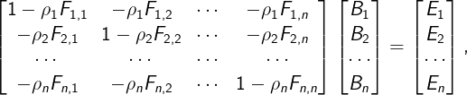
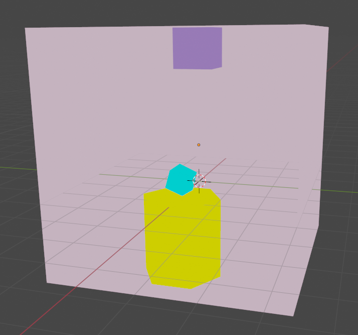
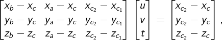
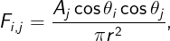

# Radiosidade

## Alunos

  - Alvaro Tedeschi Neto (ITA, COMP-23)
  - Davi Muniz Vasconcelos (ITA, COMP-23)

## Objetivo
O trabalho consistiu em calcular os novos valores de cor RGB de uma cena com a presença de uma fonte de luz. Para isso, foi utilizado o modelo de iluminação que computa as interreflexões entre os objetos de uma cena. Dessa forma, é necessário calcular o valor da energia radiante $\mathbf{B}$ segundo

    

em que $p_{i}$ representa a cor natural do objeto $i$, $F_{i,j}$ representa o fator de forma da face $i$ e da face $j$, $E_{i}$ representa o quanto a face $i$ emite naturalmente e $B_{i}$ representa a energia radiante da face $i$.

## Cena
Com o uso do Software Blender, foi possível gerar a cena para calcular a sua iluminação. O cubo em cima do teto será a fonte de luz.

    

## Implementação

### Extração dos dados do arquivo COLLADA
Para realizar a extração dos dados de vértice, de orientação das faces e de cores, foi usada a API padrão de criação e de edição de arquivos `.xml` do Python, denominada de ElementTree. Dessa forma, foi necessário determinar na árvore do arquivo `.xml` as seções de geometria `library_geometries` e de transformação do referencial do objeto para o mundo `library_visual_scenes`. Na seção de geometria, há as informações necessárias dos vértices, a orientação de cada face e a cor de cada vértice. Finalmente, gerou-se 4 objetos da classe `Solid`, os quais representam os objetos da cena e são compostos por diversos objetos `TriangularFace`.

### Checagem de uma terceira face entre duas faces
A fim de calcular o fator de forma entre as faces, é necessário verificar se existe uma terceira face que impede que as duas faces em questão consigam se ver. Assim, verificou-se se existe uma terceira face que intercepta a linha que liga os centróides das duas faces. Para isso, é preciso resolver o sistema linear que define a interseção entre a linha dos centróides e o triângulo da terceira face de acordo com

    

em que $a$, $b$ e $c$ representam os vértices da terceira face, $c_1$ representa o centróide da primeira face e $c_2$ representa o centróide da segunda face. É dito que existe uma solução válida (i.e., existe interseção entre a terceira face e a linha entre os centróides) quando $u, v, t \in [0, 1]$ e $u + v \in [0, 1]$. Caso contrário, a terceira face não está entre as duas faces em questão. Portanto, dada duas faces $i$ e $j$, verificou-se se todas as demais faces estão entre a face $i$ e a face $j$.

### Cálculo do fator de forma
A operação do cálculo de fator de forma é uma operação custosa computacionalmente. Então, foi necessário realizar uma aproximação da expressão exata do fator de forma. Para isso, utilizou-se a equação

    

em que $A_j$ é a área da face $j$, $\theta_i$ é o ângulo entre a linha que conecta os centróides das faces $i$ e $j$ e o vetor normal $\mathbf{n}_i$ da face $i$, $\theta_j$ é o ângulo entre a linha que conecta os centróides das faces $i$ e $j$ e o vetor normal $\mathbf{n}_j$ da face $j$ e $r$ é distância entre os centróides da face $i$ e da face $j$. Na prática, considerou-se que cada face triangular representa uma porção $dA$ de área.

Além disso, o fator de forma é calculado pela expressão anterior apenas se as duas faces se enxergam, ou seja, não existe uma terceira face entre a linha que conecta os dois centróides e as normais da face fazem um ângulo maior de $90 \degree$ com a linha que conecta os dois centróides. Para o cálculo das normais da face, foi usado a operação de produto vetorial a partir das coordenadas dos trẽs vértices. 

### Cálculo da matriz da expressão de iluminação
Finalmente, foi necessário calcular todos os valores de $F_{i, j}$. Como a cena gerada possui 2094 faces, optou-se por utilizar o Google Colaboratory para um maior poder computacional e a biblioteca do Python `pickle`. A biblioteca `pickle` possibilita guardar qualquer tipo de dado do Python em um arquivo `.pickle` para ser carregado em um momento posterior. Dessa forma, calculou-se os coeficientes em dois dias ao salvar e carregar os resultados intermediários com o `pickle`. O total de horas líquidas foi por volta de 14 horas.

Note que para uma cena de $n$ faces, será necessário calcular $n^2$ fatores de forma. Além disso, na implementação realizada, o cálculo da visibilidade entre faces é feita em cada $F_{i,j}$ e precisa checar $n$ faces para obter o resultado. Dessa forma, o algoritmo de fator de forma proposto possui ordem $O(n^3)$. Isso explica o tempo necessário para realizar os cálculos.

## Resultados
Por fim, foi obtida a matriz dos coeficientes para cada cor RGB. Para a fonte de luz, assumiu-se um valor de $E=1$. Para os demais objetos, assumiu-se um valor de zero. O sistema linear foi resolvido com a biblioteca `numpy`. Entretanto, todos os vetores $\mathbf{B}$ deram iguais ao vetores $\mathbf{E}$. Isso ocorreu porque a matriz de coeficientes ficou muito próxima da matriz identidade, uma vez que a maioria dos fatores de forma calculados deram muito pequenos (i.e., da ordem de $10^{-30}$).

A expressão simplificada do fator de forma é proporcional à área da face $j$. Então, se a face $j$ for bem pequena, o que foi o caso da cena gerada por causa da grande quantidade de triângulos, logo o fator de forma será também. Além disso, os valores dos cossenos estão limitados em 1 e há a distância entre os centróides ao quadrado no denominador, o que favorece para a diminuição do fator de forma. Portanto, conclui-se que a expressão não é uma boa aproximação.

Por fim, a nova cena gerada pelo modelo de iluminação coincidiu com a cena inicial devido aos problemas relatados anteriormente.