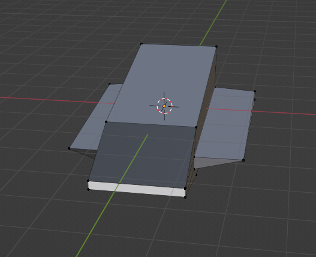
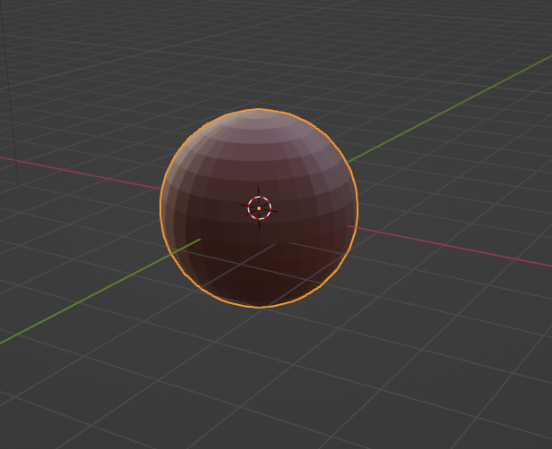
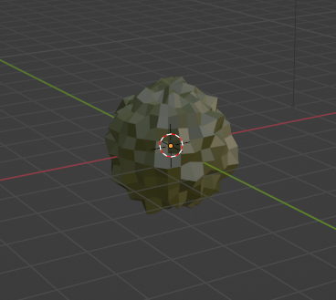

# Space Travel

## Alunos

- Alvaro Tedeschi Neto (ITA, COMP-23)
- Davi Muniz Vasconcelos (ITA, COMP-23)

## Comandos

- Aperte `R` para trocar entre a câmera global e a câmera que segue a nave espacial.
- Aperte `E` para visualizar a trajetória elíptica da nave espacial em torno do planeta vermelho.

## Modelagem
Utilizou-se o software Blender para criar os modelos 3D usados no projeto. Foram criados três modelos: uma nave espacial, um planeta vermelho e um asteroide. As Figuras 1 a 3 exibem os modelos.

    

Fig. 1 - Modelagem da nave espacial no Blender.

    

Fig. 2 - Modelagem do planeta vermelho no Blender.

    

Fig. 3 - Modelagem do asteroide no Blender.

## Implementação
Os arquivos `.gltf` importados do Blender foram carregados por meio da biblioteca `Three.js` com o objeto `THREE.GLTFLoader`. Durante o carregamento dos modelos `.gltf`, foi necessário usar as funcionalidades `async` e `await` do Javascript, visto que as modificações nos modelos só podem ser feitas após eles serem carregados. Além disso, foram colocadas duas câmeras na cena: uma câmera global que permite visualizar toda a cena com o mouse configurada por meio do objeto `THREE.OrbitControls` e uma câmera que segue a nave espacial. A câmera que segue a nave espacial é atualizada em cada *frame* de tal forma que diste de uma distância constante da nave em todo *frame*. Dessa forma, pode-se ter uma melhor experiência com a cena ao visualizá-la por diferentes câmeras. A tecla `R` permite trocar entre as câmeras.

A cena criada é composta de diferentes objetos: uma nave espacial, um planeta principal em que a nave orbita, estrelas, meteoros e outros planetas. A nave espacial segue uma trajetória elíptica em torno do planeta vermelho, em que foi usado a função `lookAt` para tornar a direção da nave espacial tangente à trajetória elíptica. Para isso, faz-se a nave espacial olhar para a sua próxima posição na trajetória elíptica. As trajetórias foram obtidas pelas funcionalidades de obtenção de curvas do `THREE.js`, como `THREE.EllipseCurve`. Ademais, o planeta vermelho está parado, mas rotaciona em torno do seu próprio eixo. As estrelas são geradas aleatoriamente no espaço por meio da função `randFloatSpread` do `Three.js`.