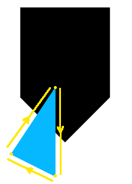
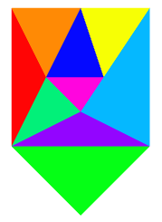

# Tangram Puzzle

## Alunos

- Alvaro Tedeschi Neto (ITA, COMP-23)
- Davi Muniz Vasconcelos (ITA, COMP-23)

## Manual

- Botão esquerdo do mouse seleciona um triângulo para mover.
- Pressione `R` para rotacionar o triângulo selecionado no sentido anti-horário.
- Pressione `E` para rotacionar o triângulo selecionado no sentido horário.

## Implementação

### Movimentação das peças

Definiu-se funções para tratar três possíveis eventos: 'click', 'mousemove' e 'keypress'. A função `onMouseClick` trata o evento 'click' e verifica se a posição atual do mouse está sobre uma peça. Foi utilizado o objeto `THREE.Raycaster` para realizar essa verificação. Caso exista alguma peça sobre o mouse, a peça é armazenada na variável global `draggable`. Além disso, para o evento 'mousemove', foi definida a função `onMouseMove` que obtém as coordenadas do mouse no referencial do mundo a partir de sua posição em pixels. Finalmente, para o evento 'keypress', definiu-se as teclas `R` e `E` como as teclas que rotacionam a peça no sentido anti-horário e no sentido horário, respectivamente. Para isso, foi usado a função `rotateZ` sobre a peça que está selecionada no instante atual.

A posição da peça que está selecionada é atualizada no laço principal do código pela função `dragPolygon`. Essa função atribui a posição atual do mouse no mundo à posição da peça selecionada. Ademais, como os triângulos foram centralizados na origem do sistema de coordenadas inicialmente, o centro do triângulo coincidirá com a posição do mouse após ser selecionado. A centralização se encontra no construtor da classe `Triangle`.

A fim de realizar os cálculos no referencial do mundo, foi necessário atualizar as posições dos vértices do triângulo nesse referencial. Ressalta-se que o THREE.js não atualiza essas posições automaticamente, o qual armazena apenas os valores dos vértices no referencial de cada triângulo. Dessa forma, atualizou-se as posições dos vértices no referencial do mundo ao realizar a translação ou a rotação de um dado triângulo selecionado. Para a translação, foi definida a função `updateVerticesPosition` que soma a posição do vértice no referencial local e a posição do referencial local no referencial do mundo. Para a rotação, foram rotacionadas as posições locais dos vértices de ângulo igual àquele da rotação do triângulo na função `updateVerticesRotationZ` e, uma vez atualizadas as posições locais, foram atualizadas as posições no referencial do mundo com a função `updateVerticesPosition`.

### Cálculo da área de interseção entre polígonos

O cálculo da área de interseção entre polígonos foi baseado no algoritmo de Sutherland-Hodgman. Para isso, foram necessárias algumas funções auxiliares, dentre elas: `pointInPolygon`, `linePolygonIntersection` e `lineLineIntersection`. A função `pointInPolygon` é necessária no algoritmo de Sutherland-Hodgman e foi implementada conforme apresentada em sala: um ponto $P = (x_p, y_p)$ está dentro de um polígono se a quantidade de vezes que a semirreta $y = y_p$ que inicia no ponto $P$ e continua para a direita intercepta as arestas do polígono for ímpar. Nesse contexto, para cada par de vértices $\{ (x_i, \ y_i), \ (x_{i+1}, \ y_{i+1}) \}$ que definem uma aresta do polígono, é verificado se a semirreta $y = y_p$ tem a chance de interceptar a aresta, sendo verdadeiro quando $\min{(y_{i}, \ y_{i+1})} \leq y_p \leq \max{(y_{i}, \ y_{i+1})}$. Em seguida, caso a condição anterior seja verdadeira, então é verificado se o ponto $P$ está a esquerda dos dois vértices da aresta do polígono com a inequação $x_p \leq \max{(x_{i}, \ x_{i+1})}$. Essa verificação é necessária porque a semirreta que inicia no ponto $P$ continua para a direita. Dado que as duas condições anteriores são verdadeiras, calcula-se a coordenada horizontal da interseção da semirreta com a aresta. Finalmente, acrescenta-se de 1 o contador de interseções e repete-se o procedimento até que todo o polígono seja percorrido.

A função `linePolygonIntersection` determina todas as interseções entre uma reta e um dado polígono ao realizar as interseções de cada aresta do polígono com a reta em questão. Para isso, a função anterior usou a função `lineLineIntersection` que determina o conjunto de interseção entre duas retas quaisquer utilizando geometria analítica. A função funciona utilizando as entradas - semiretas representadas por vetores com dois pontos que indicam o começo e o fim dessas semiretas ($[(x_1,y_1),\;(x_2,y_2)]$) - e através de um sistema de equações resulta em uma das possíveis saídas: $[\;]$ (conjunto vazio), $[(x,y)]$ (um ponto) ou $[(x_1,y_1),\;(x_2,y_2)]$ (uma semireta).

O algoritmo de Sutherland-Hodgman determina os vértices de interseção entre dois polígonos convexos. Para isso, ele analisa a posição dos vértices de todas as arestas de um dos polígonos em relação ao outro polígono, ou seja, ele verifica se os vértices das arestas de um polígono estão dentro ou fora do outro polígono e calcula os devidos pontos de interseção caso existam. Dessa forma, pode-se quebrar o algoritmo desenvolvido em quatro casos distintos.

#### Caso 01 - As duas extremidades de uma aresta estão dentro do polígono

Esse caso é trivial e apenas o vértice sucessor deve ser adicionado à lista de vértices do polígono de interseção. O outro vértice será eventualmente adicionado à lista nos casos posteriores, uma vez que ele se encontra dentro do polígono e será o sucessor de algum outro vértice posteriormente.

#### Caso 02 - Uma extremidade de uma aresta está dentro e a outra extremidade está fora do polígono de forma a entrar no polígono

A Figura 1 indica a orientação do polígono azul por meio das linhas amarelas auxiliares. Os vértices estão destacados de amarelo. Para esse caso, analisa-se a aresta que é seguida pela seta que entra no polígono preto. Por meio da função `pointInPolygon`, determina-se que tem-se um vértice fora do polígono e o vértice seguinte dentro do polígono. Portanto, deve-se calcular a interseção da aresta com o polígono preto e adicionar dois vértices a lista de vértices do polígono de interseção: o vértice da aresta que está dentro do polígono e o vértice de interseção determinado previamente.

    

Fig. 1 - Orientação dos vértices do triângulo como exemplo para o algoritmo de Sutherland-Hodgman.

#### Caso 03 - Uma extremidade de uma aresta está fora e a outra extremidade está dentro do polígono de forma a sair do polígono

Para esse caso, pode-se utilizar a Figura 1 considerando a aresta que é seguida pela seta amarela que sai do polígono. Semelhante ao caso anterior, a função `pointInPolygon` indica que o primeiro vértice da aresta está dentro do polígono e o seguinte está fora do polígono. Portanto, calcula-se a interseção da aresta com o polígono e adiciona-se apenas o vértice de interseção à lista de vértices do polígono de interseção, uma vez que o vértice que está dentro do polígono já foi adicionado previamente na etapa anterior.

#### Caso 04 - As duas extremidades de uma aresta estão fora do polígono

Caso as duas extremidades de um aresta estejam fora do polígono, então existem três possibilidades: não há interseção entre a aresta e o polígono, como é observado na Figura 1, há interseções entre a aresta e o polígono, como é observado na Figura 2, ou há um vértice do polígono preto dentro do polígono azul, como é observado na Figura 3. A primeira possibilidade é trivial e não há nada a fazer. A segunda possibilidade basta utilizar a função `linePolygonIntersection` e obter todos os vértices de interseção com essa aresta. Para a terceira possibilidade, deve-se verificar se existe algum vértice do polígono preto dentro do polígono azul e, caso exista, esse vértice deve ser adicionado à lista de vértices do polígono de interseção.

    

Fig. 2 - Caso em que dois vértices do polígono azul estão fora do polígono preto, mas interceptam o polígono.

    

Fig. 3 - Caso em que uma aresta do polígono azul não intercepta o polígono preto.

Finalmente, todos os casos citados estão implementados na função `polygonIntersection`, a qual retorna a lista de vértices do polígono de interseção entre dois polígonos quaisquer. Por fim, para calcular a área do polígono resultante da interseção, foi usado a função `THREE.ShapeUtils.area` disponível no THREE.js.

### Verificação de fim de jogo

A verificação de fim de jogo foi realizada por meio do cálculo da porção da peça preta que se encontra coberta pelas peças coloridas. Essa verificação ocorre na função `checkEnd`, a qual é chamada uma vez no laço principal. Para o cálculo, realizou-se a soma das áreas de interseção entre cada peça colorida e a peça preta. Em seguida, subtraiu-se as áreas de interseção entre as peças coloridas a fim de não realizar a contagem de uma mesma área múltiplas vezes. Portanto, o cálculo da porção da peça preta preenchida pelas peças coloridas foi calculada conforme

$$ P = \sum_{i} \frac{A(c_{i} \cap p)}{A(p)} - \sum_{i \neq j} \frac{A(c_{i} \cap c_{j})}{A(p)},$$

em que $A$ representa a área de um polígono, $c_i$ representa a peça colorida de índice $i$ e $p$ representa a peça preta. Além disso, determinou-se que um jogo é finalizado quando $P \geq 0.95$.

## Possível solução

    

Fig. 4 - Solução do Tangram Puzzle.
